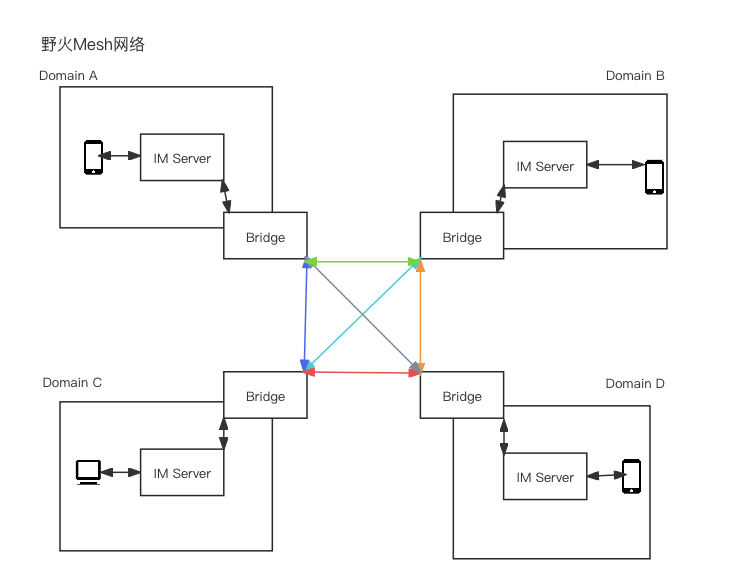
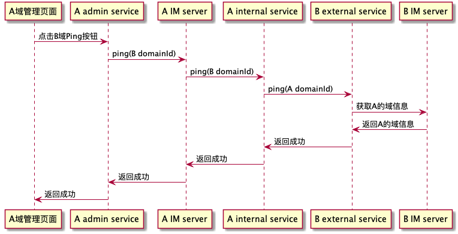

# 野火IM桥接服务
每一个野火IM服务都像是一个孤岛，只能支持当前IM服务的用户互通。使用野火IM服务桥接服务之后，就可以联通不同的IM服务，可以让隶属于不同IM服务的用户直接互通，包括发送各种消息和拨打音视频电话。

## 名词概念
IM服务： 野火IM服务，IM系统的核心服务。只有专业版IM服务支持互联互通功能，社区版不支持。

用户： 用户归属于某个IM服务，用户可以连接属于他的IM服务来添加好友、发送消息、创建群组和拨打音视频电话等操作。

桥接服务（bridge）： 参与互联的每个IM服务都有一个自己的桥接服务，这个桥接服务负责连接其他IM服务对应的桥接服务，从而实现消息的互通。

域（domain）：IM服务+用户+桥接服务 整体构成一个***域***，这个域属于某个实体（公司或者单位或者部门）所有。2个或者多个域通过桥接服务来进行互通。

网格（mesh）：多个域之间两两互联组成一张网状的结构，这个网状的结构就简称为网格。网格一般属于一个集团或者拥有一个协调者。

域ID：每个域都有一个在整个网格中唯一的ID，这个ID域的拥有者自主生成或者网格拥有者生成，需要避免碰撞的可能，建议用单位简称或者公司域名（也可以是子域名，用在一个公司下有多个部门拥有各自的域）。这个ID会拼接到目标ID中，受限于数据库中ID的长度限制，目标ID+@+域ID的总长度不能大于64，所以建议域ID越短越好，不要超过16个字符。

目标ID：IM服务中常见对象的ID，比如用户ID、群组ID和频道ID等。引入域概念之后，非本域的目标ID的格式为目标ID@域ID。比如wfc@wildfirechat.cn。

## 架构图


图上示例是4个域，每个域都有一套IM服务和其对应的用户，还有域的桥接服务。每个域的桥接服务都与其他域的桥接服务相连，从而实现不同域的用户之间的互联互通。

## 项目目录说明

1. ***mesh-bridge-web***: 桥接服务的管理后台前端页面。

2. ***mesh-bridge-server***: 桥接服务的后端服务代码。

## 前端页面
默认是把前端页面打包到软件包内的，需要先编译前端代码，请先编译***mesh-bridge-web***工程。
```
## nodejs版本18.X
npm install
npm run build
```
编译脚本会自动把生成的管理页面放到服务的资源目录，部署服务后就可以输入http://${ip}:8000访问到管理页面了.

## 后端配置
在打包前需要对项目的application.properties文件进行配置，
```
im.admin_url=http://192.168.1.81:18080
im.admin_secret=123456
```
上面是IM服务的管理内网地址和密钥，需要配置正确。

```
bridge.my_domain_id=wildfirechat.cn
```
上面这个是每个域的域ID，需要保证在整个mesh网络内唯一，且不能太长，建议用域名或者实体简称。

剩下的就是数据库了，需要手动创建数据库，使用命令```create database bridge;```创建数据库。服务使用了JPS会自动创建表，当首次启动后再执行resource目录下的data.sql创建默认管理员账户和密码.

## 后端编译
在前端编译成功和后端配置之后，在项目目录下执行:
```
mvn clean package
```

## 运行
打包之后在target找到jar包，上传到服务器上后执行
```
nohup java -jar XXXX.jar 2>&1 &
```

## 防火墙
桥接服务要联通内外，所以防火墙需要设置。首先是IM服务和桥接服务内网互通，IM服务会调用桥接服务的8100端口（配置文件中的server.internalPort)，桥接服务会调用IM服务的18080端口。另外桥接服务还开放一个管理端口8000，可以让管理员上去操作配置与其他域的连接。还有桥接服务开放API端口8200供其他桥接服务连接。

总结一下：
1. 桥接服务入访的端口有3个，8100供IM服务内网调用，8000供管理员调用，8200供其他域的桥接服务调用。因此8100是只能内网访问或者只能IM所在服务器访问，8000配置被允许访问的地址仅限于管理员所在IP段访问，8200配置开放访问或者限制来源于其他域的访问。
2. 桥接服务的出访地址有2个，桥接服务会内网访问IM服务的18080端口，另外一个是桥接服务会外网访问其他桥接服务。也请做好防火墙处理。

## IM服务配置
在2024年6.30之后发布的版本中才支持Mesh功能，在配置文件中找到配置```mesh.callback```，把配置打开并修改成桥接服务的地址，比如```http://${桥接服务的内网IP}:8100/internal```。配置之后需要重启IM服务。

## 登录
桥接服务启动后，用浏览器打开地址http://${ip}:8000就可以打开后台登陆页面，默认账户/密码为 ```admin/admin123```  登陆以后注意修改默认密码。（如果提示用户不存在，可能是上面提到的data.sql没有被执行，请执行上面的sql脚本添加管理员）。

## 管理域
在管理后台可以添加/查看/删除域。当添加域时，需要填入对方的域ID和域密钥，如果对方域密钥暂时没有，可以先添加等待对方添加生成之后再修改。添加成功后可以得到这个连接中的自己的密钥，需要把自己的域ID和这个域密钥告诉对方进行添加。双方都正确添加域后才可以互通。

## Ping
等待双方IM服务桥接服务和IM服务都处理成功之后，可以在管理后台使用ping验证，点开对方域信息，有个```测试```按钮，按下后会走通大部分流程，如下所示：


如果出现错误，可能的错误原因有如下几种：
1. 调用本地IM服务出错，也就是A admin service调用 A IM server 出现的错误，错误码为IM服务的错误码或者是HTTP状态码。解决办法是查看IM服务错误码及原因。
2. A IM Server 调用A internal service出错，错误信息为```本地域服务返回错误，错误码为xxxx，错误信息为xxxx```。解决办法就是查看IM服务有没有调用A的internal服务，还有调试A的inernal服务查看原因。
3. A internal service调用对端B external service出错，错误信息为```对端域：xxx 出现错误，错误码为：xxx，错误信息为：xxxx```。解决办法检查对端external是否收到请求及处理情况。
4. B external service调用B IM服务出错。错误信息为：```对端域：xxx 对应的IM服务出现错误，错误码为："xxx 错误信息为：xxx"```。解决办法是检查对应IM的错误信息。

当双方测试成功后，服务就建立成功了。

## 测试
等待双方测试ping成功后。找个客户端卸载重装或者等待2个小时后，查看联系人页面是否显示```外部单位```按钮。进入外部单位会列出桥接服务连接的其他域信息，选择一个域进入搜索用户，并添加好友，等待对方确认通过后，双方可以进行单聊和群聊各种测试。

## Mesh的全局管理者和Web3
理论上每个域都可以独立运行并确定与哪些域互联，实际上Mesh应该有个全局管理者或者协调者。原因有2个，一个是域ID的分配，确保每个域有全局唯一的域ID；另外一个是协调组织互联，如果新加入一个域，那么所有现有的域都需要建立连接。如果mesh中有2个域未建立连接，2个域的用户无法直接消息沟通，通过第三个域建立的群组互通也有问题。比如域A和域B建有连接，域B和域C建有连接，域A和域C没有连接，有可能域B上的用户操作群组时，会让这3个域中的用户都在同一个群组中，由于域A和域C没有连接，可能会有消息丢失和用户信息获取不到等问题。

野火这么设计是有原因的，因为野火的客户的需求就是大型单位的内部下属单位的互通，或者有部分企业和兄弟企业之间的互通，不能够支持无限制的互联互通，从而确保他们的隐私安全。

当然如果想要实现类Web3的去中心化的社交软件也是可以的。需要修改这个桥接服务，制定好桥接服务发现和自动安全交换密钥的方法，让域之间可以自动建立连接，这样每个团体（一个公司，或者一个家庭，甚至一个人）都可以架设一个属于自己的域，跟其他团体进行沟通时，消息内容仅保存在会话相关方所在的服务器，从而保障了自己的数据安全。如果你们这么修改桥接服务，就需要自己来维护这个桥接服务，并承担所有的后果，我们不再进行技术支持。

## 代码简单说明
服务包括了3部分，分别是adminService、outService和inService。
* adminService，管理域相关任务。包括管理员登录修改密码，创建/修改/删除域等功能。
* outService，外出服务，收到本域IM服务的回调，再去调用远端的域服务。
* inService，接收服务，接收远端其他域的请求，再用server api调用本侧IM服务。

在安全认证方面，adminService使用了shiro权限管理；outService接收本侧IM服务回调时是无认证的；outService调用远端inService会用接收方域密钥计算签名进行认证，详细信息请查看```shiro```目录和```multiport```目录。

## 二开需要注意事项和技术支持
一般都会使用自定义消息来对接业务，在自定义消息体中，如果包含有ID，需要在bridge发送出请求之前转化为对方的视角。比如是个名片消息，消息体内包含有用户ID。比如域1中的用户A，给域2中的用户甲发送一张名片：
1. 假如名片是域1中的用户B，那么在桥接服务请求出去的消息体内，需要把用户B的用户ID和账号拼接上域1的域ID。
2. 假如名片是域2中的用户乙，消息体内的用户id应该是乙@域2ID，那么在桥接服务请求出去的消息体内，需要把用户乙的用户ID去掉域2的域ID。
2. 假如名片是域3中的用户β，消息体内的用户id应该是β@域3ID，那么在桥接服务请求出去的消息体内，需要保持β@域3ID。

代码在OutService中的convertMessagePayloadDomainId方法中，建议二开仅限于此函数，不要修改其他代码。如果有其他需要修改的，请联系我们修改。如果您修改了这个方法之外的代码，我们就不再进行此服务的技术支持。

***因为互通的技术比较复杂且又由客户自己来部署，所以此项目必须由技术上能够完全掌握和自己有能力处理问题的团队使用，我们无法对此项目做一般性的技术支持。技术支持仅限于用我们demo进行验证，根据demo来提交问题，或者深入接口级别的问题，比如那个接口的行为不对或者那个回调参数不对等。我们无法接受笼统的问题。***

## 对象存储的处理
野火IM媒体类消息的发送过程都是先去自己所在IM服务拿到一个上传token，再把文件发送到自己的媒体服务器，再把连接放到消息体内发送出去。因此可以得知，文件都会保存在发送者所在IM服务的对象存储服务中。其他域的用户拿到消息后如果能访问对象链接地址，那么就可以不需要额外处理。如果限定仅能在本域内访问，则消息发送和分发时需要把文件传输到对端去。在OutService中的convertMessagePayloadDomainId方法中开头有注释，依据注释来开发传输文件的代码。唯一的问题是，有一定的时间差，其他域的用户收到消息后，可能需要一段时间才可以访问对象文件，如果找不到文件可以UI上加一些提示，比如提示文件正在处理请稍后提示。

## 音视频通话
野火的音视频有2个，一个是免费版本的，另外一个是高级版。这两个版本是不能互通的。所有如果需要音视频通话，那么所有的域都要使用相同的音视频。在使用免费版本音视频时，需要有turn服务可以供双方访问。在使用高级版音视频时，需要janus服务可以被双方访问，或者添加部署能被对方访问的turn服务作为中继。

## 应用服务的业务功能
在应用服务我们提供了一些业务功能，并作为业务功能开发的示例。包括群公告，会议等接口，可能会被跨服务使用，包括客户开发的其他一些功能。这些功能可能在应用服务实现，也可能是被移植到客户自己的业务服务中，因为我们就没有实现，需要客户自己实现。实现的逻辑就是：客户端调用业务服务做某项业务（比如是修改群公告）-》业务服务检查是否是外部对象（群组是其他服务的），如果是就调用本侧桥服务 -》本侧桥服务找到对端的桥地址调用 -》 对端桥服务调用对端的业务服务处理，并依次返回结果。跟IM业务跨服务逻辑一样，唯一区别就是一个是业务服务，另外一个是IM服务。

## 功能和性能的损失
某些功能做了舍弃，比如在线状态，阅读状态，因为跨网络同步这些信息时非常消耗资源且容易出错。不同IM服务之间的网络延迟也比同一个IM服务内部大好几个数量级，因此性能也会有不小的损耗。
